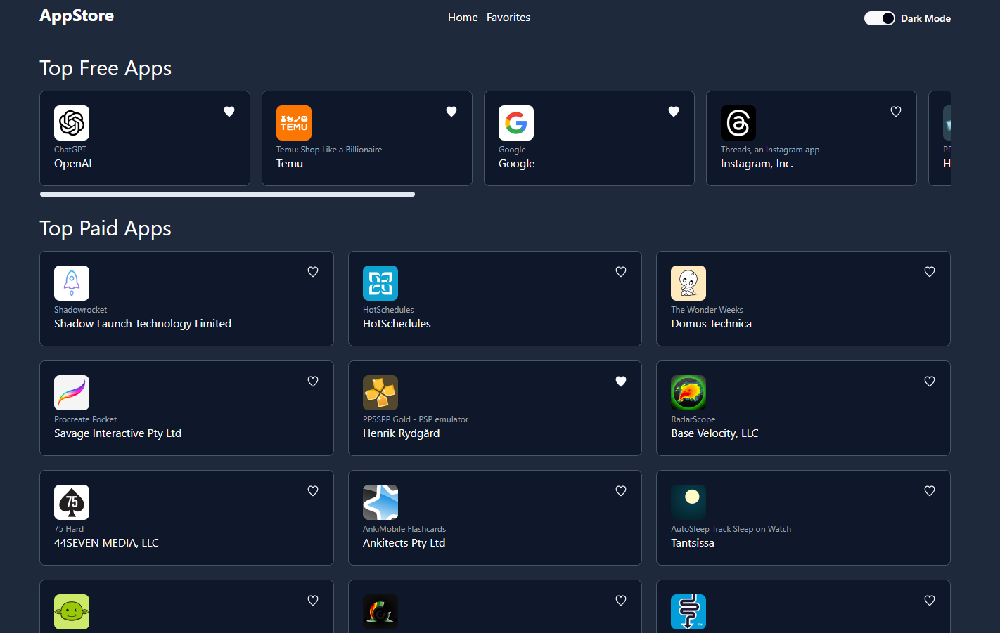

# Simple AppStore Page

to watch on local, please use these commands:

- git clone
- npm install
- npm run dev

(need to solve CORS issue + add .env file):

- missing a .env file, in order to make this app work, we need also to make this steps:

* go to this site: https://cors-anywhere.herokuapp.com/corsdemo
* click on "Request temporary access to the demo server" button
* create .env file
* add this variable to the file:
  VITE_APP_BASE_URL=https://cors-anywhere.herokuapp.com/https://rss.applemarketingtools.com

enjoy!
